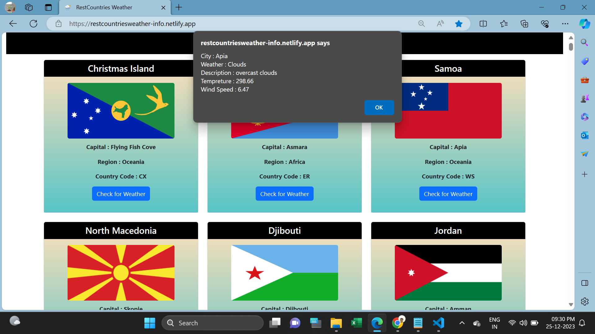

<h1>RestCountries Weather API</h1>

This webpage is used to Check weather in RestCountries.

In this page holds Restcountries Details and if want to check weather details in that country click "check for weather" button will show in popup window.

I used Html,CSS,Bootstrap,Javascript DOM using fetch API for developing this page.

I attached Webpage Screenshots in below:
   

<h2>Website URL</h2>
https://restcountriesweather-info.netlify.app/

<h2>Screenshots</h2>

1. Its main web page

 

2. Checking Weather

 

